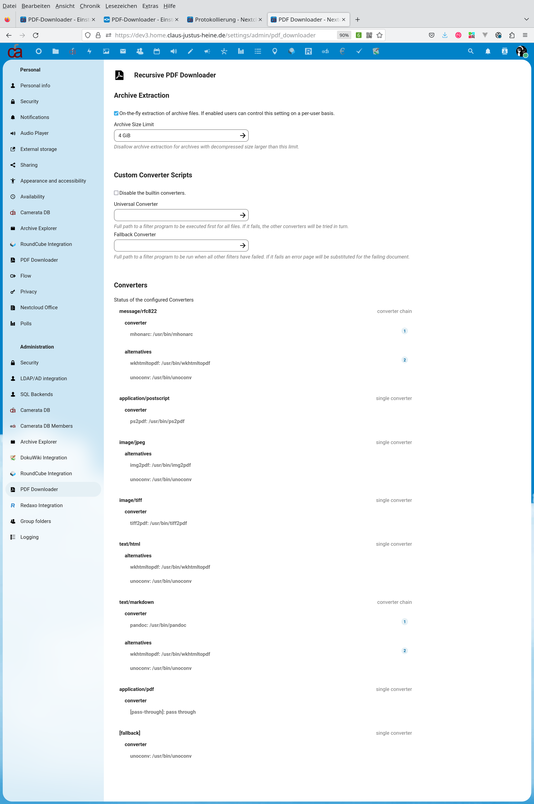
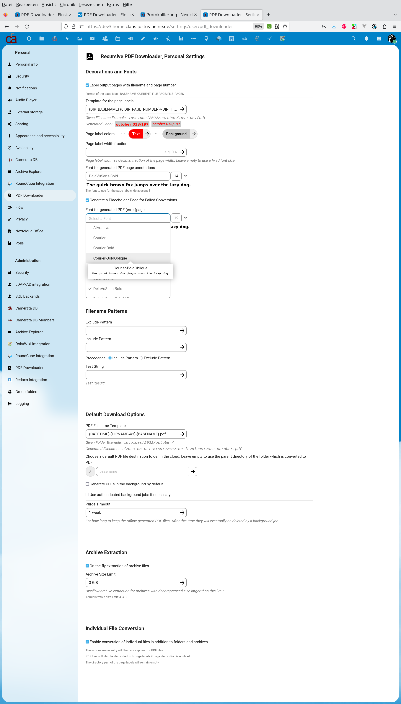

# Recursive PDF Downloader

<!-- markdown-toc start - Don't edit this section. Run M-x markdown-toc-refresh-toc -->
**Table of Contents**

- [Intro](#intro)
- [Compatibility](#compatibility)
  - [PHP, Nextcloud](#php-nextcloud)
  - [TkPDF](#tkpdf)
- [Working Conversions](#working-conversions)
  - [Builtin Converters](#builtin-converters)
  - [Custom Converters](#custom-converters)
- [On-the-fly Extraction of Archive Files](#on-the-fly-extraction-of-archive-files)
  - [Security](#security)
  - [Implementation](#implementation)
- [User Preferences](#user-preferences)
  - [Page Label and File-Name Templates](#page-label-and-file-name-templates)
  - [Overlay Font Selection](#overlay-font-selection)
  - [Include and Exclude Patterns](#include-and-exclude-patterns)
  - [Archive Files](#archive-files)
  - [Conversion of Individual Files](#conversion-of-individual-files)
- [Performance](#performance)
- [Screenshots](#screenshots)
  - [Preferences](#preferences)
  - [Files-List](#files-list)
  - [Details-View](#details-view)
- [Other Nextcloud PDF Converters](#other-nextcloud-pdf-converters)
- [Todo, some problems I am aware of](#todo-some-problems-i-am-aware-of)

<!-- markdown-toc end -->

## Intro

This is an app for the Nextcloud cloud software. It adds a new menu
entry to the actions menu of each folder, archive, or individual file in
the files view which lets you download, respectively, entire directories
trees, all files in archives, or other individual files, converted and
assembled as a single PDF file. Additionally, it adds a tab to the details
view where version actions can be performed.

For the PDF generation, the following steps are performed:

- walk through the given folder
- convert all found files to PDF
  - optionally transparently traverse archive files (zip etc.)
  - handle some special cases
  - try to convert the remaining files with `unoconv` or an
    admin-provided fallback-script
  - generate a PDF placeholder error page for each failed conversion
- then combine all found or generated PDF files in one document using
  `pdftk`
- add bookmarks to mark the start of each folder and each file
  - existing bookmarks are "shifted down" accordingly
  - the resulting bookmark structure resembles the folder structure
- optionally place a "Folder PAGE/MAX_PAGES" label at the top of each page
- finally, present the generated PDF as a download or save it to the
  cloud file system.

The app offers the choice between online and background PDF generation.
"Background" means that a job is scheduled, and then runs independently
of the web browser frontend. The user will be notified
after the job has been completed.

## Compatibility

### PHP, Nextcloud

Please refer to the [app's meta data](appinfo/info.xml)

### PDFTkJava

This is a required dependency, it must be installed. It is available
in most Linux distros. Unfortunately the [most recent release](https://gitlab.com/pdftk-java/pdftk/-/releases/v3.3.3)

## Working Conversions

### Builtin Converters

- PDF files ;) -- of course, just pass-through
- office files via LibreOffice
  - this needs `unoserver` or `unoconv` to be installed
  - see https://github.com/unoconv/unoserver
- HTML files via
  - `wkhtmltopdf` if installed
    - this program is no longer maintained but yields very good
      results
  - `weasyprint` if installed
    - Python library, actively maintained, available in most Linux
      distros.
  - `pandoc`
    - well, yields very poor results as any CSS attributes are ignored.
- EML (RFC822) files, i.e. emails you saved to disk, via `mhonarc`
  - then run the HTML to PDF conversion chain
- TIFF files via `tiff2pdf`
- Postscript files via `ps2pdf`
- everything else is passed to `unoconvert` (or `unoconv` if the newer
  `unoserver` is not installed)
- if `unoconvert` / `unoconv` fails, a PDF placeholder error page is
  generated

### Custom Converters

Administrators may specify a shell script or program for

- default conversion: try this script before any other converters, if
  it fails continue with the builtin converters
- fallback conversion: if all other converters fail, try the given
  script as a fallback, if that fails also generate an error page.

  If no fallback converter is configured then `unoconv` is used as the
  fallback.

## On-the-fly Extraction of Archive Files

If enabled by an admin users can choose to enable on-the-fly
extraction of archive files.

### Security

- To somehow reduce the danger of
  [zip bombs](https://en.wikipedia.org/wiki/Zip_bomb), there is a
  hard-coded upper limit of the decompressed archive size
- administrators can lower this limit to reduce resource usage on the
  server, or if they feel that the built-in limit of 2^30 bytes is too high.
- users may decrease this limit further on a per-user basis
- administrators may be disabled by administrators altogether
- if enable users may decide by themselves whether to enable this
  feature or not

### Implementation

This package relies on
[`wapmorgan/unified-archive`](https://github.com/wapmorgan/UnifiedArchive)
as the archive handling backend. Please see over there for a list of
supported archive formats and how to support further archive formats.

## User Preferences

### Page Label and File-Name Templates

The app allows configuring page labels and automatically generated
download and destination file names based on a user-configured
template. The details can be found in [Braced Text Templates](doc/Templates.md).

### Overlay Font Selection

- the fonts can be customized from the list of fonts shopped with `tcpdf`
- the backend generates font samples for the chosen fonts and also
  provides a preview of the configured page labels with the chosen
  font.

### Include and Exclude Patterns

Files can be included or excluded by regular expressions and a
setting controls whether one or the other regular expression
has precedence in case both patterns match. Unfortunately, those
patterns cannot (yet) be controlled from the "details" panel.

### Archive Files

If enabled by the administrators, users can optionally disable the
on-the-fly handling of archive files and also restrict the archive
size limit imposed by the admins further.

### Conversion of Individual Files

Optionally individual files (as opposed to directory trees and archives)
can directly be converted to PDF. The default is to enable this
feature. The drawback is that this adds an actions menu entry to each
filesystem node, even to PDF files themselves.

## Performance

- Unfortunately, the app is not the fastest horse one could think of.
  In particular, the `unoconv` (LibreOffice) converter tends to be
  somewhat slow. Conversion time increases linearly with the number of
  files to be converted, of course.
- It might be necessary to tweak your web server to allow for larger
  execution times (several minutes) if you do not want to make use of
  the background PDF generation.

## Screenshots

### Preferences

- admin 
- personal 

### Files-List

- directory 
- archive 

### Details-View

## Other Nextcloud PDF Converters

At least two other apps are also either dedicated to or, respectively,
allow for PDF conversion:

- [`nextcloud/workflow_pdf_converter`](https://github.com/nextcloud/workflow_pdf_converter)
  - this app is dedicated to automated PDF conversion based on workflow
    rules
  - at the time of this writing, conversion is done with LibreOffice
- [`newroco/emlviewer`](https://github.com/newroco/emlviewer)
  - as the name states this is a viewer module for `.eml` files (emails)
  - the EML view also provides a PDF download button
  - at the time of this writing, PDF conversion is done with MPDF

## Todo, some problems I am aware of

- please feel free to submit issues!
- ZIP-bomb detection might need improvement
- There is no test suite. This is really an issue.
